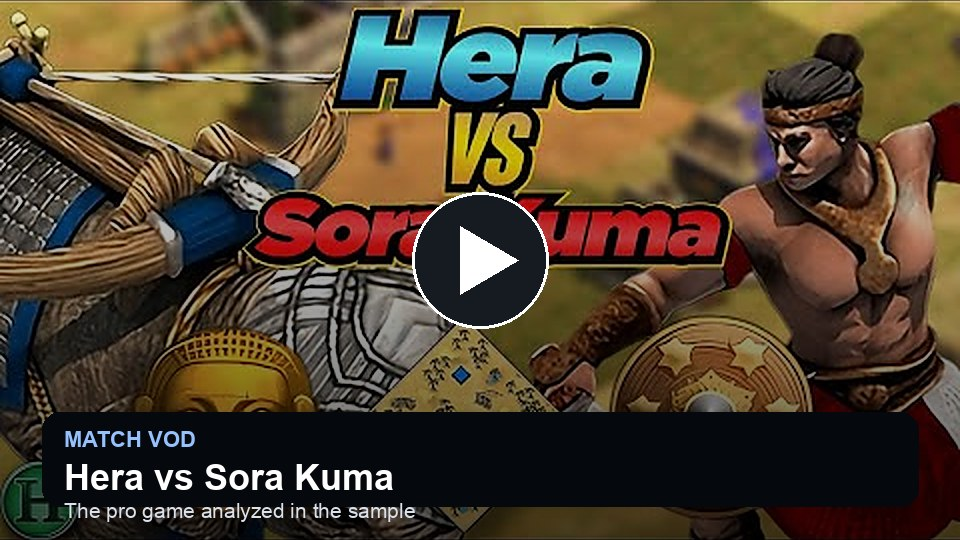

# aoe2coach

[](https://github.com/kw300/aoe2coach/actions/workflows/ci.yml)

**Age of Empires II is brutally hard to get better at.** A loss often leaves only a vague
sense that something went wrong, while re-watching the replay takes 20 minutes.

**aoe2coach lets players talk to their replays.** Drop in a game, ask what went wrong, and
it coaches from the actual replay context: openings, age-up timings, idle Town Center time,
army choices, upgrades, and the fights that swung the game.

The replay stays in the conversation. Follow-ups can dig into units, battles, economy,
market use, civ bonuses, or recurring habits across recent games without starting over.
The web workflow is built around practice focus: detect likely habits from the replay, pin
the ones worth training, carry those goals into the full coaching report, and export the
whole session when you want a portable Markdown record of the replay discussion.

**Best results currently come from replays recorded before the February 2026 Last Chieftains
update.** The full parser exposes villager queues, EAPM, map data, commands, and richer
object timelines for those games. Newer ladder games still run through a lightweight parser
while the rich parser catches up to the updated replay format.

## Demo: Hera vs Sora Kuma

This sample analyzes a Khmer vs Malay Arabia game between
[**Hera**](https://liquipedia.net/ageofempires/Hera) and
[**Sora Kuma**](https://liquipedia.net/ageofempires/Sora_Kuma), two of the strongest AoE2
players in the world. Watch the match, then try the aoe2coach web workflow on the same
replay: preview facts first, choose the player to coach, review lightweight habit
suggestions, pin the habits worth practicing, and run the full analysis when ready.

<p>
  <a href="https://www.youtube.com/watch?v=T3ZhmVcX3Vw"></a>
</p>


<video src="https://github.com/user-attachments/assets/709add66-b88c-48c4-aae0-0881067ca380" controls width="720"></video>

---

## Getting Started

### 1. Install

```bash
git clone https://github.com/kw300/aoe2coach
cd aoe2coach
python3 -m venv .venv
source .venv/bin/activate          # Windows: .venv\Scripts\activate
pip install -U pip
pip install -e ".[full,web]"       # rich parser for older replays
```

For current-patch replays, install `.[fast,web]` instead.

### 2. Configure

```bash
cp env.example .env                # add an API key/provider config (gitignored)
```

Get a key from the [Anthropic Console](https://console.anthropic.com/settings/keys) for
Claude models or [OpenAI API keys](https://platform.openai.com/api-keys) for GPT models.
You bring the key and pay the provider directly; aoe2coach does not host or resell API
access.

Anthropic:

```bash
AOE2COACH_PROVIDER=anthropic
ANTHROPIC_API_KEY=sk-ant-...
```

OpenAI:

```bash
AOE2COACH_PROVIDER=openai
OPENAI_API_KEY=sk-...
```

API calls cost money; check [Anthropic pricing](https://www.anthropic.com/pricing) or
[OpenAI pricing](https://platform.openai.com/docs/pricing/) before running full analysis.
aoe2coach uses a lightweight model for preliminary habit detection and a flagship model
for the replay report and detailed coaching.
The CLI and browser UI read local `.env`; the web app never asks for or stores API keys.

Optional model overrides, reasoning effort, and OpenAI-compatible endpoint examples are in
[`env.example`](env.example).

Prefer to bring the model through an MCP-compatible assistant instead of configuring an
aoe2coach API key? That path is in progress; see
[Other ways to run it](#other-ways-to-run-it) and [docs/mcp.md](docs/mcp.md).

### 3. Run

```bash
aoe2coach web                      # opens a browser
```

Then drag in a replay, or pick one from the left pane. The web app previews deterministic
facts before any full analysis call: map, players, civs, result, replay date, minimap,
fundamentals, and a readable timeline. Choose the player to coach, review the lightweight
practice-focus suggestions, pin any habits worth tracking, add custom habits if desired,
then run the full analysis using the flagship model. Pinned and detected habits are passed into
the report so the coach can connect the replay evidence to the player's current training
goals. Use **Export session** to save the current preview, habits, timeline, and chat as a
Markdown file under `reports/session-exports/` and download a copy from the browser.

Prefer the terminal? The CLI does the same, scriptably:

```bash
aoe2coach find                  # locate replay files
aoe2coach analyze latest        # save a report
aoe2coach trends --last 10      # recurring habits
aoe2coach metrics latest        # stats JSON
aoe2coach minimap latest        # map PNG
```

Bring an API key. Cost depends on the model and provider: aoe2coach can use a cheaper
model for practice-focus detection and a flagship model for the final coaching report.
Saved reports land in `reports/` ([Read a sample aoe2coach chat](reports/session-exports/aoc-mgz-de-66.6-2026-06-02-10-13-30.md)).

## What It Provides

**1. A coaching report with a point of view:**
```
Jian Hei reached Feudal a minute faster — then stalled. A 232-second idle Town Center
right after Feudal cost ~8 villagers, and it never recovered: 71 villagers to 112, no
Imperial, and a Janissary mass that couldn't out-scale Bombards. Top priority: never
idle the TC. You already have the speed; add the villagers.
```

**2. Practice focus workflow** — before running the full report, choose the player being
coached and let a lightweight model suggest replay-specific habits. Pin the useful ones,
add custom goals, and the full analysis will explicitly account for those practice goals
instead of producing a generic post-game review.

**3. Habit tracking across games** — `aoe2coach trends --last 10` looks for recurring
patterns: *"Feudal-Age upgrades are missing in 7 of the last 10 games, and 1,500+ wood is
floating by Castle in most games. Fixing those two issues would clean up the Feudal timing
problem."*

**4. Interactive coaching** — `aoe2coach web` opens a browser chat: pick a replay, choose
the player to coach, run the full report, then ask follow-ups ("why was the fight at 25
minutes so expensive?", "what keeps going wrong?") in a real conversation. An in-progress
MCP path can also bring replay metrics to compatible assistants — see
[Other ways to run it](#other-ways-to-run-it).

**5. Session export** — the web UI can export the current replay preview, practice-focus
habits, fundamentals, timeline, and chat transcript as Markdown, then save it locally and
download a browser copy.

## How it works

The core idea: **do the exact, boring stuff in code; let the model do the judgment.**

```
replay file  →  parse  →  compute the stats  →  model coaches on them  →  report
 (.aoe2record)  (mgz)     (villager timings,     (a few KB of JSON,
                           idle TC, build order,   compact metrics)
                           who won each fight)
```

Timings, villager counts, and who lost which fight are computed deterministically in
Python. The model coaches from a few KB of structured stats plus a "what good looks like"
reference, which keeps the report fast, cheap, and grounded in the replay.

### Replay Data Used

- **Age-up timings** (Feudal / Castle / Imperial) and the gaps between them
- **Villager production → idle Town Center detection** — the #1 macro leak ⚡
- **Build order** — every building, named and timestamped
- **Army composition & unique-unit usage**, and **named techs/upgrades researched** ⚡
- **Key tech status** ⚡ — researched vs available-but-missed vs unavailable for common
  upgrade lines, grounded in the local civ tech tree
- **Resource float** — banked resources sitting unspent ⚡
- **Engagement timeline** — when fights happened, losses per side, who won the trade ⚡
- **EAPM** ⚡, **win/loss, civ, map**, and each player's **real ladder ELO** (by profile ID)
- **Player colors** normalized from parser-provided color labels when available, so UI
  highlights, minimap markers, and model context agree across replay versions.

⚡ = needs the rich parser (older replays; see [below](#which-replays-work)). Current-patch
games still give ages, build order, civs, and result.

## Which replays work

The replay format changes every patch, and the rich parser
([`mgz`](https://github.com/happyleavesaoc/aoc-mgz)) currently covers the format used
before the February 2026 **Last Chieftains** update:

- **Pre-February-2026 replays → the full treatment** (villager production, idle-TC, EAPM,
  engagement timeline, minimap). Install `.[full]`.
- **February-2026-and-newer replays → lightweight parsing** via
  [`mgz-fast`](https://github.com/AoEInsights/aoc-mgz) — build order, age timings, result,
  fewer deep stats. Install `.[fast]`. *(Why the lag:
  [aoc-mgz #138](https://github.com/happyleavesaoc/aoc-mgz/issues/138).)*

**Want compatible replays to try?** The [`aoc-mgz` replay corpus](https://github.com/happyleavesaoc/aoc-mgz/tree/master/tests/recs)
has older pre-February-2026 AoE2/AoC replay files (`.mgz` / `.aoe2record`), including the
GL.Hera games used for the demos.

## Under the hood

aoe2coach tries to give the model replay evidence that is small enough to reason over, but
specific enough to stop vague advice:

- **Economy rhythm:** villager queue gaps are converted into estimated idle Town Center
  time, so "make more villagers" is tied to the exact minutes where production slipped.
- **Age and building tempo:** Feudal/Castle/Imperial timings, first production buildings,
  and major techs are kept as timestamped events instead of fuzzy opening labels.
- **Fight pressure:** on rich replays, object-count drops are grouped into engagements with
  losses per player and a trade result. It is not a tactical replay viewer, but it tells the
  coach which fights probably decided the game.
- **Upgrade grounding:** common techs are checked against the local civ tech tree before the
  model sees them, so unavailable upgrades are marked unavailable and missed upgrades stay
  separate from researched ones.
- **Practice focus:** detected and pinned habits are included in the final model request as
  training priorities, so the report can connect the current replay to what the player is
  actively trying to improve.
- **Player colors:** color labels from the parser are normalized before metrics reach the
  web UI or model, with raw color IDs used only as a fallback. This avoids off-by-one
  palette mistakes across replay/parser versions.

## Other ways to run it

**MCP (in progress, no aoe2coach API key) — bring replay metrics to an assistant.**
aoe2coach ships a working MCP server (`tools`: `list_replays`, `replay_metrics`,
`replay_trends`; `prompts`: `coach`, `coach_trends`). The server exposes deterministic
replay data through standard MCP, but setup packaging and replay-selection UX are still
being polished. Claude Code/Desktop are the currently documented clients. Full setup:
**[docs/mcp.md](docs/mcp.md)**.

## Roadmap

- **Player profiles and goal-aware coaching** — build reusable player profiles from recent
  games, pinned habits, ELO context, civ/map patterns, and recurring weaknesses, then aim
  each single-game report at the habits most likely to move that player up.
- **Multi-game trend habit coaching** — make `trends --last 10` sharper by grouping habits
  by map, civ, matchup, game phase, and loss pattern, then turn that trend summary into
  coaching analysis and practice goals inside the web workflow.
- **Latest-patch rich parsing** — close the current AoE2 patch gap by extracting more data
  from `mgz-fast` and routing old/new replays through the right parser automatically.
- **MCP assistant workflow** — polish the MCP path so players can coach from compatible
  assistants, with packaged config snippets and clearer replay UX.
- **Model choice and cost profiles** — add documented presets for flagship, budget,
  OpenAI-compatible, and local models, plus clearer cache/cost reporting.
- **Coaching evaluation harness** — maintain a small anonymized replay corpus with expected
  metric snapshots and golden coaching checks, so parser changes and prompt edits can be
  regression-tested.
- **Coach behavior and game-knowledge tuning** — keep refining the system prompt for
  coaching style, patch-aware AoE2 knowledge, civ/unit nuance, and better follow-up answers.
- **Smarter engagement analysis** — combine object losses with command positions, unit
  costs, and selected-object IDs to estimate where fights happened and what they were worth.
- **Build-order and ELO benchmarks** — compare openings, timings, and civ/map performance
  against matchup-aware templates and public rating-bracket data.

## Limitations

- The rich parser currently covers replays from before the February 2026 Last Chieftains
  update; newer ladder games use the lighter parser.
- Engagement analysis is intentionally coarse today. Rich parsing provides build/research/unit
  inputs, map data, starting objects, command positions, and object/resource time series.
  aoe2coach uses drops in those timelines to mark costly fights and the side that bled more
  value. Exact composition, positioning, kill attribution, and pathing-level battle
  reconstruction belong to a future simulation-grade analysis path.

## Credits

Built on [**mgz**](https://github.com/happyleavesaoc/aoc-mgz) and the
[**AoEInsights `mgz-fast`** fork](https://github.com/AoEInsights/aoc-mgz) (replay parsing),
the [**SiegeEngineers aoe2techtree**](https://github.com/SiegeEngineers/aoe2techtree)
dataset (game-data names), and bring-your-own model providers for the coaching.

## License

MIT — see [LICENSE](LICENSE).
